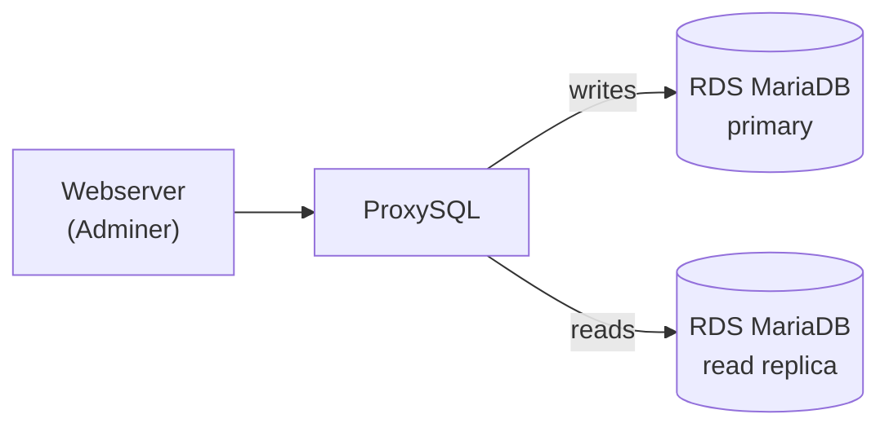

# Terraform ProxySQL RDS

A small, self-contained AWS environment for testing and experimenting with
[ProxySQL](https://proxysql.com) in front of RDS. Terraform stands up the infrastructure and Ansible
configures it.



- a **webserver** EC2 instance running Adminer, for poking at the database through the proxy
- a **ProxySQL** EC2 instance the webserver connects to, which splits reads and writes
- an **RDS MariaDB** primary (writer) and a **read replica**, reachable only from ProxySQL

## What it builds

**Terraform** creates:

- RDS MariaDB 11.4 — a primary and a read replica. The master password is generated and stored in AWS
  Secrets Manager (KMS-encrypted).
- Two EC2 instances (webserver, ProxySQL) on the latest Ubuntu 24.04 AMI, looked up at plan time.
- Security groups scoped to what each box needs; SSH and HTTP are limited to your IP.

**Ansible** then:

- configures RDS — creates an app database and the application + monitor users
- configures the webserver — Apache, PHP and Adminer 5.x
- configures ProxySQL 3.x — hostgroups, backends, users and a query rule

## You will need

- Terraform >= 1.5 (OpenTofu works too — Terraform moved to the BSL licence at 1.6)
- AWS credentials able to create EC2, RDS and Secrets Manager resources
- Either Ansible installed locally, or Docker (the Makefile can run Ansible through a pinned toolchain image)

Credentials and region come from the standard AWS chain — export `AWS_PROFILE` (or access keys) and
`AWS_REGION` before anything that touches AWS. Nothing is baked into the code.

## Configure

**1. Terraform variables** — copy the example to a gitignored `terraform.tfvars` and fill it in:

```
cp terraform/terraform.tfvars.example terraform/terraform.tfvars
```

| Name | Type | Required | Description |
|------|------|----------|-------------|
| `region` | string | no (default `us-east-1`) | AWS region to deploy into |
| `vpc` | string | yes | VPC ID the EC2 instances and RDS go into |
| `subnets` | list(string) | yes | Subnet IDs in that VPC (RDS needs at least two AZs) |
| `my_ip_address` | string | yes | Your public IP; a `/32` SSH and HTTP allow rule is created for it |
| `ssh_public_key_path` | string | yes | Path to the SSH public key registered as the EC2 key pair |
| `disable_api_termination` | bool | no (default `false`) | Termination protection on the EC2 instances |

**2. Passwords** — the ProxySQL admin, app-user and monitor-user passwords live in an Ansible Vault file:

```
cd ansible
cp group_vars/all/vault.yml.example group_vars/all/vault.yml
# set real passwords in vault.yml, then encrypt it:
ansible-vault encrypt group_vars/all/vault.yml
```

Pass `--ask-vault-pass` (or `--vault-password-file`) to the playbooks. The real `vault.yml` is gitignored.

## Run it

The `Makefile` wraps the whole flow:

```
make up          # terraform init + apply
make configure   # the Ansible playbooks (rds, webserver, proxysql), in order
make down        # terraform destroy
```

`make help` lists every target. No Ansible installed? `make tools-build` builds a pinned toolchain image,
and `make lint` / `make shell` run through it.

Or run the steps by hand:

```
cd terraform
terraform init
terraform apply

cd ../ansible
ansible-playbook rds.yml
ansible-playbook -i webserver_aws_ec2.yml webserver.yml
ansible-playbook -i proxysql_aws_ec2.yml proxysql.yml
```

The dynamic inventories find the instances by their `Name` tag using your AWS credentials and `AWS_REGION`.

When it's done, connect to the database through the proxy with Adminer at
`http://<webserver_public_ip>/adminer.php` — the webserver address is a Terraform output
(`terraform output webserver`).

## Checks

```
make validate    # terraform fmt -check, init and validate — no AWS access needed
```

`pre-commit` runs `terraform fmt`, `tflint` and `ansible-lint` before each commit (`pre-commit install`).
On every pull request, CI runs `terraform fmt`, `init` and `validate` (required), plus `tflint`, Trivy
config scanning and `ansible-lint`.

## Cost

About **$35/month** if you leave it running (us-east-1, on-demand) — mostly the two RDS instances; the
EC2 boxes are a couple of dollars each. Approximate breakdown:

| Resource | Type | ~ Monthly (USD) |
|----------|------|-----------------|
| RDS primary | db.t4g.micro + 20 GB | ~14 |
| RDS read replica | db.t4g.micro + 20 GB | ~14 |
| ProxySQL | EC2 t3a.nano | ~4 |
| Webserver | EC2 t3a.nano | ~4 |
| Secrets Manager + KMS | | ~1 |
| **Total** | | **~37** |

For an exact, current figure run [Infracost](https://www.infracost.io): `infracost breakdown --path terraform`.

## Troubleshooting

If Terraform reports that a secret with this name is already scheduled for deletion, force-delete it:

```
aws secretsmanager delete-secret --secret-id rds --force-delete-without-recovery --region "$AWS_REGION"
```
